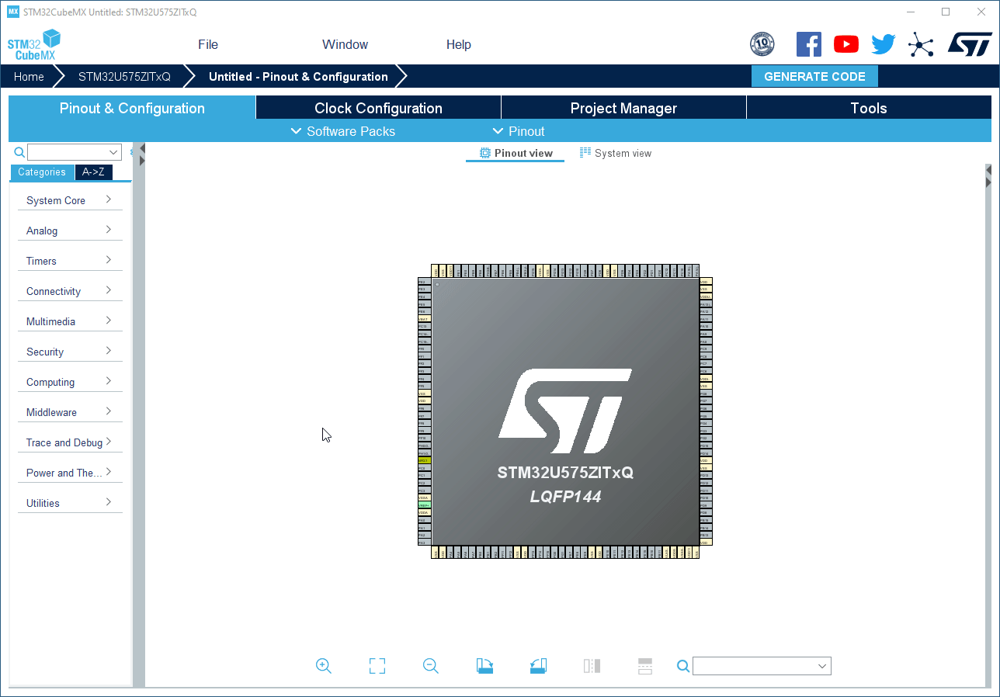
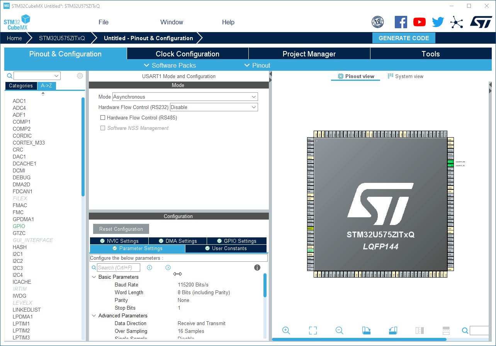
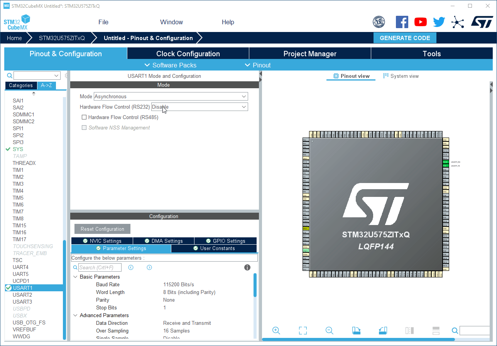
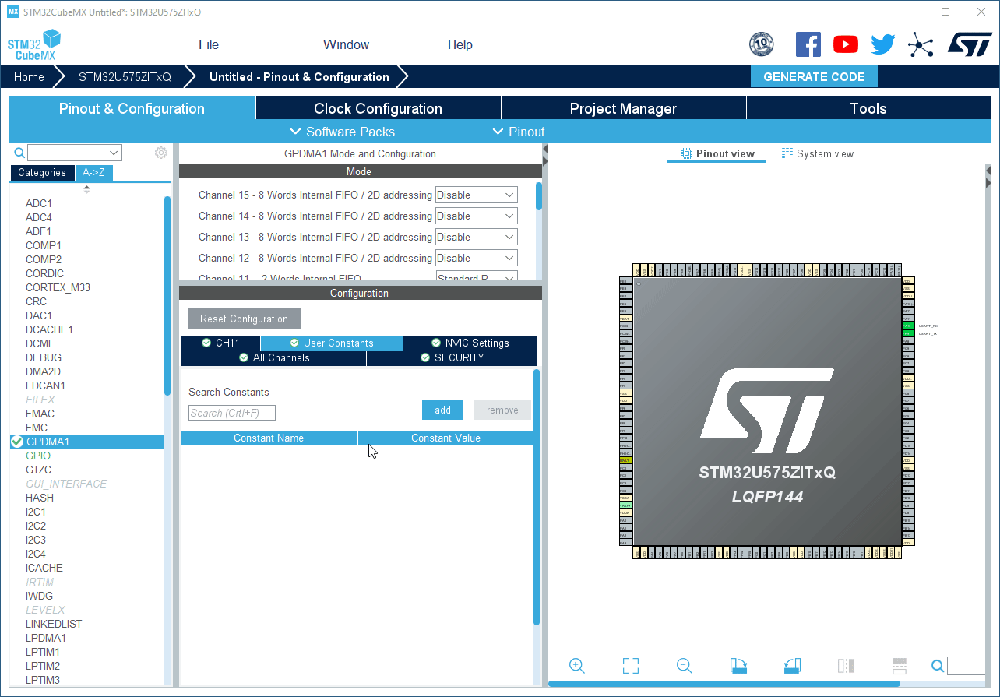
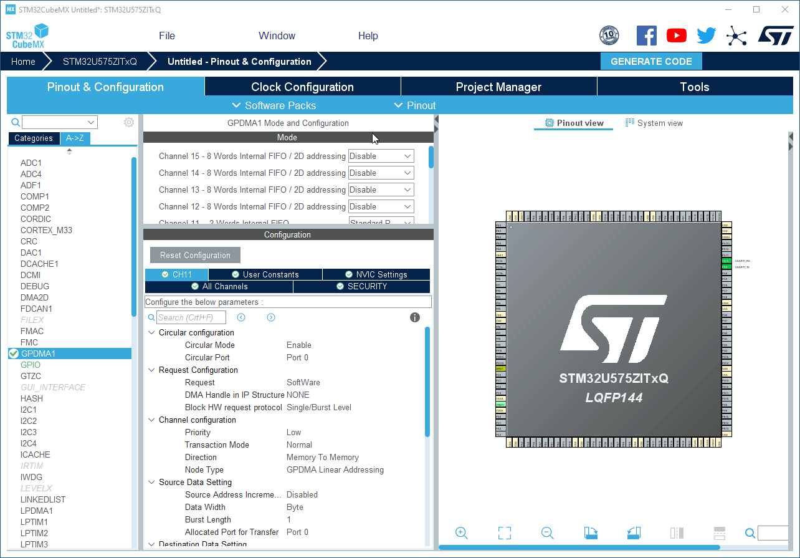
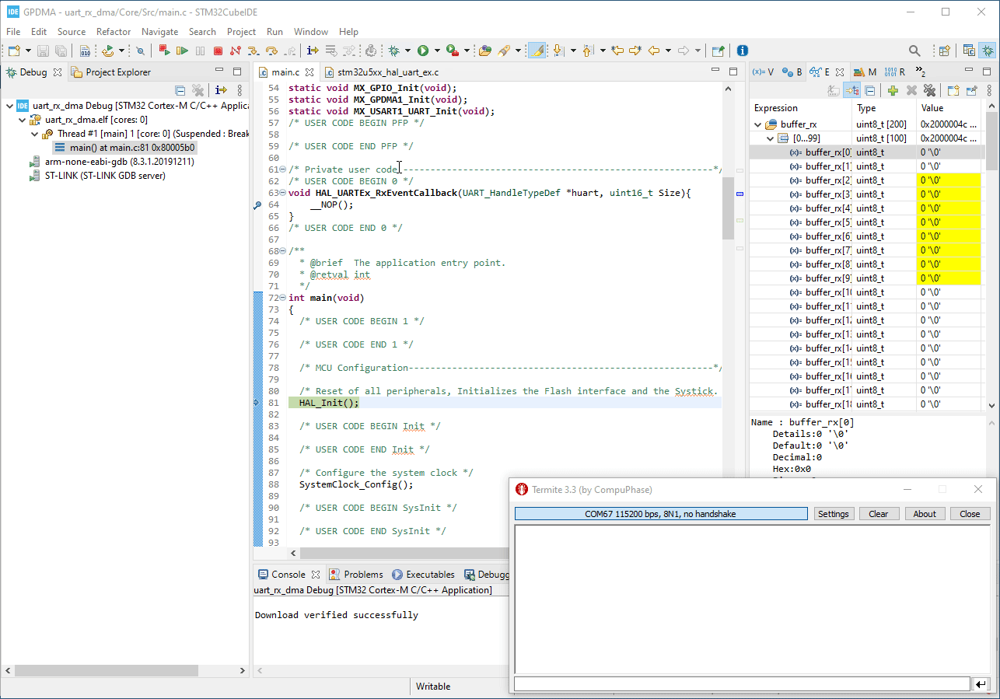

# Simple UART Rx with GPDMA

Basic example to show how to configure GPDMA to be able handle UART Rx Data. 

1. Create new project

Description is here [Link](./mx_create_project.md)

2. Select `UART` (on STM32U575-Nucleo `UART1` is connected to ST-Link VCP)
3. Set UART mode to `Asynchronous` (standart UART mode)
   1. We can keep default settings 115200baud, 8word length, 1 stop bit, no parity
   2. Pins on STM32U5 nucleo should be PA9 & PA10



4. Select NVIC tab and enable UART global interrupt



We need this to be able detect ending events

5. Select `GPDMA channel `(`Channel 11`) in `Standart Request Mode`
   


6. Enable `circular mode`
   This will allow receive the data with **unknown** length



7. Set request source for `UART1_RX`



8. Keep direction from periphery to memory

9. Set `Destination Address Increment` to `Enable` 


10. Rest of settings can be in default state

## What we did so far

We enabled the UART1 and also its IRQ. his will help us detect when we stop receiving data because of IDLE state. And we can take this data from DMA.
We aso enabled GPDMA to hadnle UART's DMA requests and transfer data to memory in circle. With HT and TC interrupt we can also take data during receiving. 

11. Set project name and generate code:

Description is here [Link](./mx_generate_code.md)

<ainfo>
Not neede if you use MX in CubeIDE
</ainfo>


12. Import project to CubeIDE [Link](./ide_import_project.md)

<ainfo>
Not neede if you use MX in CubeIDE
</ainfo>

13.  Create `buffer_rx` buffer for rx data 

```c
uint8_t buffer_rx[200];
```

Put into `PV` section

```cc
/* USER CODE BEGIN PV */
uint8_t buffer_rx[200];
/* USER CODE END PV */
```

14.  Start the UART reception to DMA by `HAL_UARTEx_ReceiveToIdle_DMA`

This this is best way how to receive unknown amount of data. If we know the data amount to receive we can use `HAL_UART_Receive_DMA`

```c
 HAL_UARTEx_ReceiveToIdle_DMA(&huart1, buffer_rx, 200);
```

Put it to Section like this

```cc
  /* USER CODE BEGIN 2 */
  HAL_UARTEx_ReceiveToIdle_DMA(&huart1, buffer_rx, 200);
  /* USER CODE END 2 */
```

`&huart1` is uart handle which contains also ling to gpdma
`buffer_rx` is our rx buffer where we expect data
`200` buffer size

15. Define Rx callback when line is IDLE or HT/TC interrupt

We use `__weak` callback from hal library

```c
void HAL_UARTEx_RxEventCallback(UART_HandleTypeDef *huart, uint16_t Size){
	__NOP();
}
```

Put it to `section 0` like this

```cc
/* USER CODE BEGIN 0 */
void HAL_UARTEx_RxEventCallback(UART_HandleTypeDef *huart, uint16_t Size){
	__NOP();
}
/* USER CODE END 0 */
```

<ainfo>
The `HAL_UARTEx_RxEventCallback` is returning also position in RX buffer. So we can keep get amount of captured bytes
</ainfo>

16. We can now run debug and test the rx data in `HAL_UARTEx_RxEventCallback`




