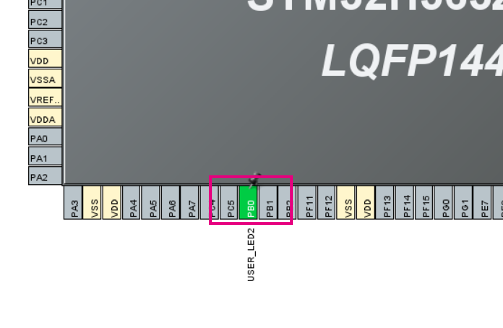

----!
Presentation
----!

# I3C hands-on: Introduction

Goal of this hands-on is to create simple I3C example, basically a communication between two boards

- Controller
- Target 

The Controller will perform a dynamic address assignment 
The Target board will send an In-band-interrupt (IBI) when a button is pressed

- Please work in prais to test this hands-on. Choose who will be the Controller and who will develop the target!

The example is based on I3C_Controller_InBandInterrupt_IT and I3C_Target_InBandInterrupt_IT examples for Nucleo-H503RB

// here we could add the picture of kumper cables //

# I3C Controller Sequence

1. Initialize I3C
2. Start dynamic address assigment
	* This will assign address to each new device
3. Configure/ Enable reception of IBI from selected adresses
	* if we skip this step we never get the ACK from the controller
	* this is just interla operation, no communication on the I3C bus
	* real sensor will probably need some more commands or register writes to be enabled

4. We receive IBI via I3C interrupt
5. We read IBI source address and payload in main loop
	** LED is toggled when IBI is received **


# Create CubeMX project for Controller 

1. Select **NUCLEO-H563ZI** - this will initialize the LEDs and push buttons automatically
2. When prompted "Initialize all peripherals in default mode", select **no**
3. Select project **without TrustZone**
	


# Configure I3C peripheral for Controller

1. Enable I3C1 in **Controller** mode <br />
	* Leave default config - I3C pure bus, Frequency= 12500kHz
	
2. Enable event & error interrupts in NVIC <br />
	

# Move I3C pins to PB8/PB9

To move pins:
1. CTRL + left-click on the pin to see alternative pins
2. Drag & drop

Alternatively you can also click directly on PB8 and PB9 and select the function


We can leave the default GPIO setting
Internal pull-up on GPIO is 40kOhm tipycal


# Enable USART3

_**This step should be done automatically when creating project with "Initialize all peripherals in default mode"**_

Enable USART3 in **Asynchronous** mode
Leave the default configuration (115200 baudrate, 8-bits without parity)


# Configure LED
Assign PB0 to GPIO output and name it "USER_LED2"


	
# Configure MX_I3C1_Init properties

1. Go to **Project Manager** > **Project Name** give it a name
2. Select **STM32CubeIDE** as toolchain
3. Click on **Generate code**


# modify the main.c file

I3C Controller variables definition

```c
/* USER CODE BEGIN PV */
volatile uint32_t uwTargetCount = 0;    /* Number of I3C targets enumerated */
uint8_t targetAddr = 0x32;              /* Address of I3C target */
volatile uint32_t uwEnumDone= 0;        /* Flag for signaling end of enumeration */
volatile uint64_t lastUid;              /* Last UID (incl. BCR, DCR) */

/* Used for IBI reception */
I3C_DeviceConfTypeDef DeviceConf;       /* Struct for configuring IBI reception */
volatile uint32_t uwIBIRequested = 0;   /* Flag signaling IBI received */
I3C_CCCInfoTypeDef CCCInfo;             /* Struct for reading IBI payload */

/* Used for sending SETMRL */
I3C_CCCTypeDef CCCDesc;                 /* Describes CCC direct/broadcast transfer */
I3C_XferTypeDef xferData;               /* More generic XFER sturcture used by HAL */
uint32_t xferData_conrol;               /* Buffer for C-FIFO (single word) */
uint8_t xferData_tx[3];                 /* Buffer for TX-FIFO (3-bytes) */
/* USER CODE END PV */
```

# implement ENTDAA callbacks
```c
/* USER CODE BEGIN 0 */
void HAL_I3C_TgtReqDynamicAddrCallback(I3C_HandleTypeDef *hi3c, uint64_t targetPayload)
{
  /* Send associated dynamic address */
  HAL_I3C_Ctrl_SetDynAddr(hi3c, targetAddr + uwTargetCount);
  /* Store target ID */
  uwTargetCount++;
  lastUid = targetPayload;
}

void HAL_I3C_CtrlDAACpltCallback(I3C_HandleTypeDef *hi3c)
{
  /* Enumeration completed */
  uwEnumDone = 1;
  /* Print debug info about device */
  uint8_t bcr = __HAL_I3C_GET_BCR(lastUid);
  uint8_t dcr = (uint8_t)(lastUid >> 56);
  printf("%d targets enumerated\n", uwTargetCount);
  printf("Last BCR: 0x%x, DCR: 0x%x, full UID: 0x%llx\n", bcr, dcr, lastUid);
}

void HAL_I3C_NotifyCallback(I3C_HandleTypeDef *hi3c, uint32_t eventId)
{
  if ((eventId & EVENT_ID_IBI) == EVENT_ID_IBI)
  {
    uwIBIRequested = 1;
  }
}

void HAL_I3C_ErrorCallback(I3C_HandleTypeDef *hi3c){
  /* Broadcast address not acknowledged */
  if(hi3c->ErrorCode == HAL_I3C_ERROR_CE2){
    printf("No target enumerated\n");
    uwEnumDone = 1;
  }
}
```

# Implement Printf via UART
```c
/* USER CODE BEGIN Includes */
#include "stdio.h"
#include "string.h"
#define PUTCHAR_PROTOTYPE int __io_putchar(int ch)
/* USER CODE END Includes */
```

below **HAL_I3C_ErrorCallback**

```c

PUTCHAR_PROTOTYPE
{
	 HAL_UART_Transmit(&huart3, (uint8_t *)&ch, 1, 0xFFFF);
	 return ch;
}

/* USER CODE END 0 */

```

# Execute dynamic address assignment
```c
/* USER CODE BEGIN 2 */
  printf("\n\nHello STM32H5!\n");
    HAL_I3C_Ctrl_DynAddrAssign_IT(&hi3c1, I3C_RSTDAA_THEN_ENTDAA);

    while(uwEnumDone == 0);

    if(uwTargetCount > 0){
      DeviceConf.DeviceIndex = 1;
      DeviceConf.TargetDynamicAddr = 0x32;
      DeviceConf.CtrlRoleReqAck = DISABLE;
      DeviceConf.CtrlStopTransfer = DISABLE;
      DeviceConf.IBIAck = ENABLE;
      DeviceConf.IBIPayload = ENABLE;
      HAL_I3C_Ctrl_ConfigBusDevices(&hi3c1, &DeviceConf, 1);
   
    }

    HAL_I3C_ActivateNotification(&hi3c1, NULL, HAL_I3C_IT_IBIIE);
    printf("Waiting for event...\n");
  /* USER CODE END 2 */

```

# Controller main loop
After this step you can build and program controller board

```c
 /* USER CODE BEGIN WHILE */
  while (1)
  {

	  while(uwIBIRequested == 0);

	     HAL_I3C_GetCCCInfo(&hi3c1, EVENT_ID_IBI, &CCCInfo);
	     HAL_GPIO_TogglePin(USER_LED2_GPIO_Port, USER_LED2_Pin);
	     uwIBIRequested = 0;

	     printf("Interrupt received from 0x%x, count = %d, data = 0x%x\n",  CCCInfo.IBICRTgtAddr, CCCInfo.IBITgtNbPayload, CCCInfo.IBITgtPayload);

    /* USER CODE END WHILE */

    /* USER CODE BEGIN 3 */
  }

```


