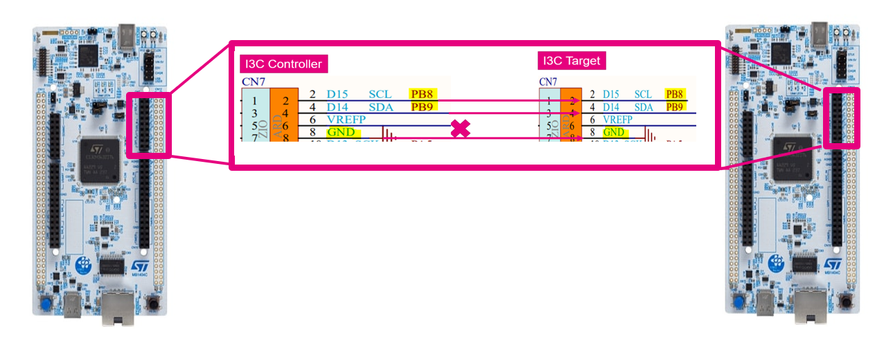
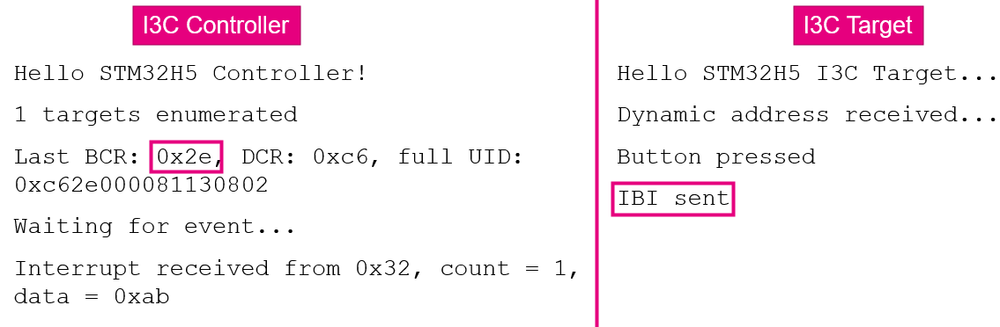

----!
Presentation
----!

# I3C connection- Connect the boards together
Work in pair and follow the connection showed in picture

1. Power-off both boards
2. User the 3 provided jumper wires to connect signals between boards
Following signals from Arduino CN7 must be connected
SCL
SDA
(skip VDDA)
GND

**Power the Target board first, then Controller board**
**Pressing User button on Target board should toggle LED on both boards**

# Expected output
Open a serial terminal emulator on both your laptops this is what you shall observe

