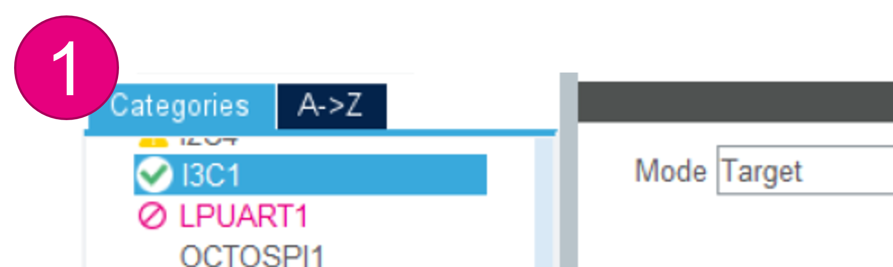

----!
Presentation
----!

# I3C Target Firmware Sequence

1. Initialize I3C
2. Wait for dynamic address assigment
3. Wait for button press
4. Send IBI when button press is detected
5. Wait for IBI completion

Steps 3-5 are performed in loop sequence


# Create CubeMX project for Controller 

1. Select **NUCLEO-H563ZI** - this will initialize the LEDs and push buttons automatically
2. When prompted "Initialize all peripherals in default mode", select **no**
3. Select project **without TrustZone**
	


# Configure I3C peripheral for Controller

1. Enable I3C1 in **Target** mode <br />
	* Leave default config - I3C pure bus, Frequency= 12500kHz
	
2. Enable event & error interrupts in NVIC <br />
	
3. Set **Target Chracteristi ID** to 0xC6
	- This is the DCR MIPI value for MCU
4. Enable **In-band-Interrupt authorized and associated additional data**
5. Keep **Payload 1bye**
	
# Move I3C pins to PB8/PB9

To move pins:
1. CTRL + left-click on the pin to see alternative pins
2. Drag & drop

Alternatively you can also click directly on PB8 and PB9 and select the function


We can leave the default GPIO setting
Internal pull-up on GPIO is 40kOhm tipycal


# Enable USART3

_**This step should be done automatically when creating project with "Initialize all peripherals in default mode"**_

Enable USART3 in **Asynchronous** mode
Leave the default configuration (115200 baudrate, 8-bits without parity)


Map USART3 to PD8 and PD9 which are connected to STLINK VCP


# Configure Wakeup Button
Assign PC13 to GPIO output and name it «WAKEUP»


# Configure LED
Assign PB0 to GPIO output and name it "USER_LED2"


	
# Configure MX_I3C1_Init properties

1. Go to **Project Manager** > **Project Name** give it a name
2. Select **STM32CubeIDE** as toolchain
3. Click on **Generate code**


# modify the main.c file

I3C Target variables definition

```c
/* USER CODE BEGIN PV */
/* USER CODE BEGIN PV */
uint8_t ubPayloadBuffer[] = {0xAB};

/* Variable to catch ENTDAA completion */
__IO uint8_t ubDynamicAddressCplt = 0;

/* Variable to catch IBI end of process */
__IO uint8_t ubIBIcplt = 0;
/* USER CODE END PV */
```

# implement notifications callbacks
```c
/* USER CODE BEGIN 0 */
void HAL_I3C_NotifyCallback(I3C_HandleTypeDef *hi3c, uint32_t eventId)
{
  if ((eventId & EVENT_ID_DAU) == EVENT_ID_DAU)
  {
    /* Set Global variable to indicate the the event is well finished */
    ubDynamicAddressCplt  = 1;
  }

  if ((eventId & EVENT_ID_IBIEND) == EVENT_ID_IBIEND)
  {
    /* Set Global variable to indicate the the event is well finished */
    ubIBIcplt = 1;

    /* Toggle LED2: Transfer in transmission process is correct */
    HAL_GPIO_TogglePin(USER_LED2_GPIO_Port,USER_LED2_Pin);
  }
}
```

# Implement Printf via UART
```c
/* USER CODE BEGIN Includes */
#include "stdio.h"
#include "string.h"
#define PUTCHAR_PROTOTYPE int __io_putchar(int ch)
/* USER CODE END Includes */
```

below **HAL_GPIO_TogglePin**

```c

PUTCHAR_PROTOTYPE
{
	 HAL_UART_Transmit(&huart3, (uint8_t *)&ch, 1, 0xFFFF);
	 return ch;
}

/* USER CODE END 0 */

```

# I3C target initialization
```c
 /* USER CODE BEGIN 2 */
  printf("Hello STM32H5 I3C Target...\n");

    HAL_I3C_ActivateNotification(&hi3c1, NULL, (HAL_I3C_IT_DAUPDIE | EVENT_ID_IBIEND));

    while (ubDynamicAddressCplt != 1)
    {
    }

    printf("Dynamic address received...\n");
  /* USER CODE END 2 */

```

# Target main loop
After this step you can build and program target board

```c
   while (1)
  {

	  while(HAL_GPIO_ReadPin(WAKEUP_GPIO_Port, WAKEUP_Pin) == GPIO_PIN_SET);
	      while(HAL_GPIO_ReadPin(WAKEUP_GPIO_Port, WAKEUP_Pin) == GPIO_PIN_RESET);

	      HAL_I3C_Tgt_IBIReq_IT(&hi3c1, ubPayloadBuffer, 1);

	      printf("Button pressed\n");

	      while(ubIBIcplt == 0);

	      ubIBIcplt = 0;

	      printf("IBI sent\n");
    /* USER CODE END WHILE */

    /* USER CODE BEGIN 3 */
  }

```


