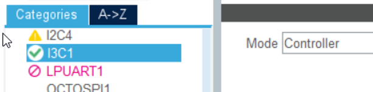
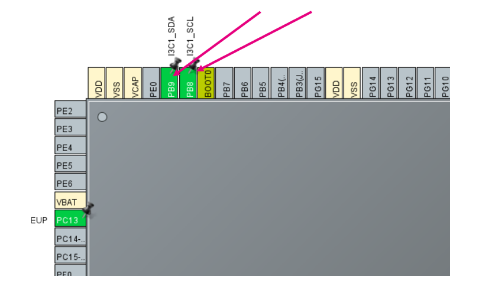

----!
Presentation
----!

# I3C hands-on: Introduction

Goal of this hands-on is to create simple I3C example, basically a communication between two boards

- Controller
- Target 

The Controller will perform a dynamic address assignment 
The Target board will send an In-band-interrupt (IBI) when a button is pressed

- Please work in prais to test this hands-on

The example is based on I3C_Controller_InBandInterrupt_IT and I3C_Target_InBandInterrupt_IT examples for Nucleo-H503RB

// here we could add the picture of kumper cables //

# I3C Controller Sequence

1. Initialize I3C
2. Start dynamic address assigment
	* This will assign address to each new device
3. Configure/ Enable reception of IBI from selected adresses
	* if we skip this step we never get the ACK from the controller
	* this is just interla operation, no communication on the I3C bus
	* real sensor will probably need some more commands or register writes to be enabled

4. We receive IBI via I3C interrupt
5. We read IBI source address and payload in main loop
	** LED is toggled when IBI is received **


# Create CubeMX project for Controller 

1. Select **NUCLEO-H563ZI** - this will initialize the LEDs and push buttons automatically
2. When prompted "Initialize all peripherals in default mode", select **no**
3. Select project **without TrustZone**
	


# Configure I3C peripheral for Controller

1. Enable I3C1 in **Controller** mode <br />
	* Leave default config - I3C pure bus, Frequency= 12500kHz
	
2. Enable event & error interrupts in NVIC <br />
	

# Move I3C pins to PB8/PB9

To move pins:
1. CTRL + left-click on the pin to see alternative pins
2. Drag & drop

Alternatively you can also click directly on PB8 and PB9 and select the function



We can leave the default GPIO setting
Internal pull-up on GPIO is 40kOhm tipycal


# Enable USART3

_**This step should be done automatically when creating project with "Initialize all peripherals in default mode"**_

Enable USART3 in **Asynchronous** mode
Leave the default configuration (115200 baudrate, 8-bits without parity)


# Configure LED
Assign PB0 to GPIO output and name it "USER_LED2"


	
# Configure MX_I3C1_Init properties

1. Go to **Project Manager** > **Project Name** give it a name
2. Select **STM32CubeeIDE** as toolchain
3. Click on **Generate code**


# Create Core\Src\i3c_reg_io.c

Create new source file Core\Src\i3c_reg_io.c with following content:

```c
#include "i3c_reg_io.h"
#include <stdio.h>

/* Handle for I3C */
extern I3C_HandleTypeDef hi3c1;

/* Notifications to be passed from IRQ during enumeration */
static volatile uint32_t uwTargetCount = 0;
static volatile uint32_t uwEnumDone = 0;
static volatile uint64_t lastTargetID = 0;

int32_t BSP_I3C_Init(void){
    /* Struct for configuring IBI reception */
	I3C_DeviceConfTypeDef DeviceConf;

	/* Call MX generated initialization */
	MX_I3C1_Init();

	/* Begin enumeration (dynamic address assignment) process.
	 * Reset dynamic address first (is necessary if only MCU is reset).
	 */
	printf("Starting enumeration...\n");
	HAL_I3C_Ctrl_DynAddrAssign_IT(&hi3c1, I3C_RSTDAA_THEN_ENTDAA);

	/* Wait for enumeration to be finished */
	while(uwEnumDone == 0);

	/* Report I3C device parameters
	 * Expected output (for LSM6DSO):
	 * DCR = 0x44, BCR = 0x7
	 * Full ID =  0x44070b106c000802
	 */
	printf("Enumeration done successfully...\n");
	printf("DCR = 0x%02x, BCR = 0x%02x\nFull ID = 0x%08x%08x\n",
			(unsigned int)((lastTargetID >> 56) & 0xFF), (unsigned int)((lastTargetID >> 48) & 0xFF),
			(unsigned int)((lastTargetID >> 32) & 0xFFFFFFFFUL), (unsigned int)(lastTargetID & 0xFFFFFFFFUL));

	/* Configure and enable in-band interrupt (IBI) */
	DeviceConf.DeviceIndex = 1;
	DeviceConf.TargetDynamicAddr = (0xD7 >> 1);
	DeviceConf.CtrlRoleReqAck = DISABLE;
	DeviceConf.CtrlStopTransfer = DISABLE;
	DeviceConf.IBIAck = ENABLE;
	DeviceConf.IBIPayload = ENABLE;
	HAL_I3C_Ctrl_ConfigBusDevices(&hi3c1, &DeviceConf, 1);

	/* Enable IBI interrupt inside I3C peripheral */
	HAL_I3C_ActivateNotification(&hi3c1, NULL, HAL_I3C_IT_IBIIE);

	return 0;
}

/* Variable for sending event to MEMS application */
extern volatile uint8_t MemsEventDetected;
volatile I3C_CCCInfoTypeDef CCCInfo;

void HAL_I3C_NotifyCallback(I3C_HandleTypeDef *hi3c, uint32_t eventId)
{
  if ((eventId & EVENT_ID_IBI) == EVENT_ID_IBI)
  {
	  /* Process IBI request */

	  /* Notify MEMS application */
	  MemsEventDetected = 1;
	  /* Read additional data from the interrupt payload.
	   * Not used in this example.
	   */
	  HAL_I3C_GetCCCInfo(hi3c, EVENT_ID_IBI, (I3C_CCCInfoTypeDef*)&CCCInfo);
  }
}

void HAL_I3C_TgtReqDynamicAddrCallback(I3C_HandleTypeDef *hi3c, uint64_t targetPayload)
{
  /* Assign address based on targetPayload */
  /* Here we expect only single I3C target present on the bus */

  /* Send associated dynamic address */
  HAL_I3C_Ctrl_SetDynAddr(hi3c, (0xD7 >> 1) + uwTargetCount);
  uwTargetCount++;

  /* Store target ID */
  lastTargetID = targetPayload;
}

void HAL_I3C_CtrlDAACpltCallback(I3C_HandleTypeDef *hi3c)
{
  /* Enumeration completed */
  uwEnumDone = 1;
}


void HAL_I3C_ErrorCallback(I3C_HandleTypeDef *hi3c){
	if(uwEnumDone == 0){
		printf("Enumeration failed...\n");
	}
}

int32_t BSP_I3C_DeInit(void){
	HAL_I3C_DeInit(&hi3c1);
	return 0;
}

int32_t BSP_I3C_WriteReg(uint16_t Addr, uint16_t Reg, uint8_t *pData, uint16_t Length){
	/* Wait until previous transfer finish */
	while(!LL_I3C_IsActiveFlag_CFE(hi3c1.Instance));

	/* Start private write transfer (1+N byte = register start address + register values) */
	LL_I3C_ControllerHandleMessage(hi3c1.Instance,Addr >> 1, Length+1, LL_I3C_DIRECTION_WRITE,
			LL_I3C_CONTROLLER_MTYPE_PRIVATE, LL_I3C_GENERATE_STOP);

	/* Send register start address */
	LL_I3C_TransmitData8(hi3c1.Instance, (uint8_t)(Reg & 0xFF));

	while(1){
		/* Check if we can write more data */
		if(LL_I3C_IsActiveFlag_TXFNF(hi3c1.Instance)) {
			if(Length > 0){
				if(Reg == 0x18){
					/* Hack to prevent disabling I3C by X-Cube-MEMS in LSM6DSO */
					/* Filter out disabling of I3C interface in CTRL_9_XL register */
					LL_I3C_TransmitData8(hi3c1.Instance, (*pData) & 0xFD);
				}
				else {
					LL_I3C_TransmitData8(hi3c1.Instance, *pData);
				}
				Reg++;
				pData++;
				Length--;
			}
		}
		/* Check for error flag */
		if(LL_I3C_IsActiveFlag_ERR(hi3c1.Instance)){
			LL_I3C_ClearFlag_ERR(hi3c1.Instance);
			return -1;
		}
		/* Check if the transfer has finished */
		if(LL_I3C_IsActiveFlag_FC(hi3c1.Instance)){
			LL_I3C_ClearFlag_FC(hi3c1.Instance);
			return (Length == 0)?0:-1;
		}
	}
	return 0;
}


int32_t BSP_I3C_ReadReg(uint16_t Addr, uint16_t Reg, uint8_t *pData, uint16_t Length){
	/* Wait until previous transfer finish */
	while(!LL_I3C_IsActiveFlag_CFE(hi3c1.Instance));

	/* Start private write transfer (1 byte = register start address) */
	LL_I3C_ControllerHandleMessage(hi3c1.Instance,Addr >> 1, 1, LL_I3C_DIRECTION_WRITE,
			LL_I3C_CONTROLLER_MTYPE_PRIVATE, LL_I3C_GENERATE_RESTART);

	/* Send register start address */
	LL_I3C_TransmitData8(hi3c1.Instance, (uint8_t)(Reg & 0xFF));

	/* Start private read transfer (N bytes = register values) */
	LL_I3C_ControllerHandleMessage(hi3c1.Instance,Addr >> 1, Length, LL_I3C_DIRECTION_READ,
			LL_I3C_CONTROLLER_MTYPE_PRIVATE, LL_I3C_GENERATE_STOP);

	while(1){
		/* Check if we can write new data */
		if(LL_I3C_IsActiveFlag_RXFNE(hi3c1.Instance)) {
			if(Length > 0){
				*pData = LL_I3C_ReceiveData8(hi3c1.Instance);
				pData++;
				Length--;
			}
		}
		/* Check for error flag */
		if(LL_I3C_IsActiveFlag_ERR(hi3c1.Instance)){
			LL_I3C_ClearFlag_ERR(hi3c1.Instance);
			return -1;
		}
		/* Check if the transfer has finished */
		if(LL_I3C_IsActiveFlag_FC(hi3c1.Instance)){
			LL_I3C_ClearFlag_FC(hi3c1.Instance);
			return (Length == 0)?0:-1;
		}
	}
	return 0;
}
```

# Create Core\Inc\i3c_reg_io.c

Create new source file Core\Inc\i3c_reg_io.h with following content:

```c
#ifndef __I3C_REG_IO_H
#define __I3C_REG_IO_H

#include "main.h"

#ifdef __cplusplus
extern "C" {
#endif


int32_t BSP_I3C_Init(void);
int32_t BSP_I3C_DeInit(void);
int32_t BSP_I3C_WriteReg(uint16_t Addr, uint16_t Reg, uint8_t *pData, uint16_t Length);
int32_t BSP_I3C_ReadReg(uint16_t Addr, uint16_t Reg, uint8_t *pData, uint16_t Length);

#ifdef __cplusplus
}
#endif

#endif /* __MAIN_H */
```

# Modify iks01a3_conf.h

Modify user code section in file MEMS\Target\iks01a3_conf.h:

```c
/* USER CODE BEGIN 1 */
#include "i3c_reg_io.h"

#define USE_IKS01A3_ENV_SENSOR_HTS221_0                1U
#define USE_IKS01A3_ENV_SENSOR_LPS22HH_0               1U
#define USE_IKS01A3_ENV_SENSOR_STTS751_0               1U

#define USE_IKS01A3_MOTION_SENSOR_LSM6DSO_0            1U
#define USE_IKS01A3_MOTION_SENSOR_LIS2DW12_0           0U
#define USE_IKS01A3_MOTION_SENSOR_LIS2MDL_0            0U

#define IKS01A3_I2C_Init BSP_I3C_Init
#define IKS01A3_I2C_DeInit BSP_I3C_DeInit
#define IKS01A3_I2C_ReadReg BSP_I3C_ReadReg
#define IKS01A3_I2C_WriteReg BSP_I3C_WriteReg
#define IKS01A3_GetTick BSP_GetTick
#define IKS01A3_Delay HAL_Delay

#ifdef __cplusplus
}
#endif

#endif /* __IKS01A3_CONF_H__*/

/* Discard rest of the file */
#if 0
/* USER CODE END 1 */
```

This will overwrite the BSP to use I3C functions we created in i3c_reg_io.c/.h files.

# Modify main.c

Modify MX_I3C1_Init function to change the timing for I3C.
At the moment the STM32CubeMX allows only configuration wiht hight pulse <50ns. This is unfortunately not compatible with level shifter on X-Nucleo-IKS01A3 board

```c
  /* USER CODE END I3C1_Init 1 */
  hi3c1.Instance = I3C1;
  hi3c1.Mode = HAL_I3C_MODE_CONTROLLER;
  hi3c1.Init.CtrlBusCharacteristic.SDAHoldTime = HAL_I3C_SDA_HOLD_TIME_1_5;
  hi3c1.Init.CtrlBusCharacteristic.WaitTime = HAL_I3C_OWN_ACTIVITY_STATE_0;
  hi3c1.Init.CtrlBusCharacteristic.SCLPPLowDuration = 0x7c;   /* <---- */
  hi3c1.Init.CtrlBusCharacteristic.SCLI3CHighDuration = 0x7c; /* <---- */
  hi3c1.Init.CtrlBusCharacteristic.SCLODLowDuration = 0x7c;
  hi3c1.Init.CtrlBusCharacteristic.SCLI2CHighDuration = 0x7c;
  hi3c1.Init.CtrlBusCharacteristic.BusFreeDuration = 0x6a;
  hi3c1.Init.CtrlBusCharacteristic.BusIdleDuration = 0xf8;
  if (HAL_I3C_Init(&hi3c1) != HAL_OK)
  {
    Error_Handler();
  }

```


