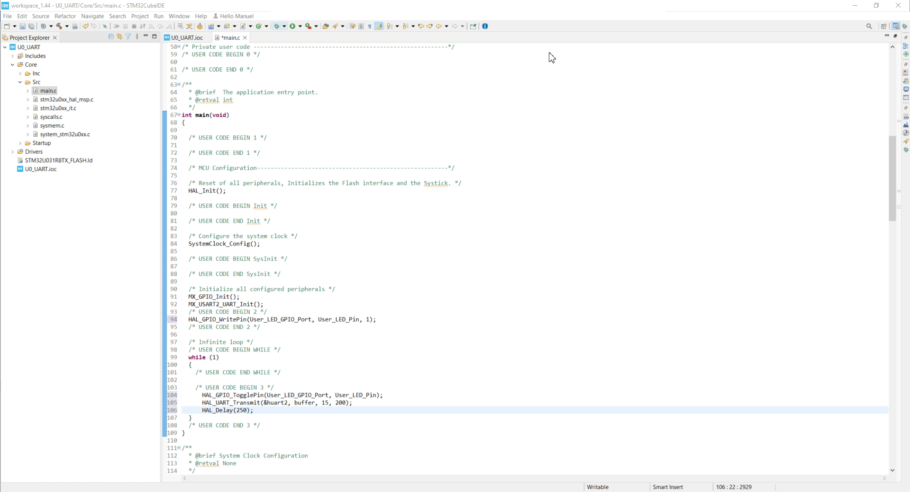

----!
Presentation
----!

# Introduction
## Dear Participant of STM32U0 Workshop,
<br>

<awarning>
.ZIP file containing workshop slides can be found **[here](https://github.com/manu19901991/STM32--South_Africa_Workshop/blob/main/STM32_WS_SA_24_1.zip)**
</awarning>

---
<ainfo>
You are supposed to move the following section "Before STM32U0 session" once you completed this chapter
</ainfo>

----

Welcome to our comprehensive guide on how to prepare for the live version of the STM32U0 Workshop session. This step-by-step guide is designed to provide you with all the necessary information about the prerequisites, installation process, and links to materials that will be useful during the session.

In this guide, you will find detailed information about the required software and hardware, as well as a brief overview of the installation process. Additionally, we have included links to materials that will be helpful during the session.

In the appendix, you will find some basic information about the board that we will be using during the session, as well as useful information about the configuration and usage of the STM32CubeIDE.
<br>

To navigate through this guide, please use the navigation buttons provided.
<br>

  

<br>

If you have any questions or encounter any problems, please do not hesitate to contact us at  **[manuel.marcias@st.com](manuel.marcias@st.com)**

We look forward to seeing you at the STM32U0 Workshop live session!
<br>

## Yours,
## STMicroelectronics 
<br>

# Prerequisites
- Hardware:
  - **PC with MS Windows 10 operating system and admin rights granted**
  - **2 type-c/type-A USB** cables
  <br>
  
  <br>

  - **1 Micro USB** cable
 <br>
  
  <br>

  <br>
  - **2 female-female wires** (min 10cm length) to connect gold pins 
  <br>
  
  <br>

  - **[NUCLEO-U031R8](https://www.st.com/en/evaluation-tools/nucleo-u031r8.html)** Nucleo-144 development board. It will be provided to you by ST during the handson
  <br>
  
  <br>
 <br>
  - **[STM32L562E-DK](https://www.st.com/en/evaluation-tools/stm32l562e-dk.html)** board which will be lent to each participant for the time of the workshop 
  <br>
  
  <br>


- Software (PC with **MS Windows 10** operating system):
  - **[STM32CubeMX](https://www.st.com/en/development-tools/stm32cubemx.html)** in version 6.12.0 or later
  - **[STM32CubeIDE](https://www.st.com/en/development-tools/stm32cubeide.html)** in version 1.16.0 or later
  - **[STM32U0 Cube library](https://www.st.com/en/embedded-software/stm32cubeu0.html)** in version 1.1.0 or later
  - **[Virtual COM port drivers](https://www.st.com/en/development-tools/stsw-stm32102.html)**
  - **[STM32Cube Monitor Power](https://www.st.com/en/development-tools/stm32cubemonpwr.html)** in version 1.2.0
  - **[STM32Cube Programmer](https://www.st.com/en/development-tools/stm32cubeprog.html)** in version 2.17.0 or later
  -  any **serial terminal** application (e.g. **[Termite](https://termite.software.informer.com/3.4/)**)
<br>

# Installation process
- download **STM32CubeMX** from [here](https://www.st.com/en/development-tools/stm32cubemx.html)
- install **STM32CubeMX** (if not yet done)
- download **STM32CubeIDE** from [here](https://www.st.com/en/development-tools/stm32cubeide.html)
- Install **STM32CubeIDE** (if not yet done)
- download and install **STM32U0 Cube library** (if not done yet):
  - run **STM32CubeMX**
  - go to `Help -> Manage Embedded Software Packages`
  - within package manager window find `STM32U0`, unroll it and select newest available version ( in your case STM32U0 1.1.0)
  - press `install now`
<br>


<ainfo>
STM32CubeMX and STM32CubeIDE are using the same repository by default, so the installed STM32U0 Cube library will be visible in both tools.
</ainfo>


<br>
----


# Verification process before the workshop
The purpose of this part is checking whether all software components are installed properly.
<br>
Additionally prepared test project can be a base for next hands-on parts during the workshop.

## **STM32CubeIDE and STM32U0 Cube library**
<br>

----

<br>
**Task definition**
<br>

- Using STM32CubeIDE
  - Enable SWD for debug
  - Disable TrustZone
  - Configure ICACHE (in any of available modes)
- Select and configure USART3
  - in asynchronous mode,
  - using default settings (115200bps, 8D, 1stop bit, no parity) 
  - on PA9/PA10 pins
<br>

----

<br>
## **Step1** - project creation and peripherals configuration
 - Run **STM32CubeIDE**
 - Specify workspace location (i.e. `C:\_Work\U0_UART`)
<br>

<br>
- Start new project using one of the below methods:
  - by selecting `File->New->STM32Project` 
  - by click on `Start new STM32 project` button
  <br>
  
<br>
- switch to **Board Selector** tab
- select NUCLEO-**U031**R8 board
- press `Next` button
- within STM32 Project window:
  - specify project name (i.e. `U0_UART`)
  - press `Finish` button
  - on question pop-up window "Initialize all peripherals with their default state?" press `No` button 
  - on question pop-up window "Switch to proper CubeIDE perspective?", if it is showed, press `Yes` button 
  - on worning pop-up window "Do you still want a code generation?", press `No` button 
  - on following information pop-up window, it was our decision did not generate code, press `OK` button
  - Unselect BSP functionality 
  <br>
   
<br>
- Peripherals configuration: Pinout&Configuration tab

- **USART2 configuration** (Connectivity group)
  - select Asynchronous mode
  - keep default settings in configuration:
    - Basic parameters: 115200bps, 8bits data, 1 stop bit, no parity
    - Pins assignment: PA2, PA3
    - no interrupts, no DMA usage
  <br>
    
<br>

- **Project settings**
  - select `Project Manager` tab
  - check project location (.ioc file)
  - check project name
<br>
   
<br>
  - generate project by one of the ways:
    - by pressing "gear" icon
    - by select `Project->Generate Code`
    - by pressing **Alt+K**
<br>
  
<br>

----

<br>
## **Step2** - coding part (`main.c` file)
<br>
Define the buffer of bytes to be sent over **USART2** (`USER CODE PV` section):
<br>

```c
  uint8_t buffer[]={"Hello STM32U0\r\n"};
```

<br>

<br>
Turn on **User_LED_Pin** (`USER CODE 2` section):
<br>

```c
    HAL_GPIO_WritePin(User_LED_GPIO_Port, User_LED_Pin, 1);
```

<br>

<br>
Toggle **User_LED_Pin** (`USER CODE 3` section) 
<br>
Start transmit of the data over **USART2** using prepared buffer and ***polling*** method
<br>
Wait for 250 ms
<br>

```c
  HAL_GPIO_TogglePin(User_LED_GPIO_Port, User_LED_Pin);
  HAL_UART_Transmit(&huart2, buffer, 15, 200);
  HAL_Delay(250);
```

<br>

<br>

----

<br>
## **Step 3** - build the project
- Build the project using `hammer` button or `Project->Built All` or **Ctrl+B**
<br>

<br>

<ainfo>
In case of neither errors nor warnings after this process, STM32CubeIDE and STM32U0 library are installed correctly. Last point - debug session will be verified during first hands on part on the workshop.
</ainfo>


## ** 2 STM32CubeMonitorPower **

Please start STM32CubeMonitorPwr and check that you can see similar window as a final effect.
<br>

<br>


<ainfo>
## **Congratulations** You have completed installation part. Now you are fully prepared for the live workshop session. 
</ainfo>


----

# Materials for the session
- Access to tools dedicated web pages:
  - [STM32CubeIDE](https://www.st.com/en/development-tools/stm32cubeide.html)
  - [STM32CubeMX](https://www.st.com/en/development-tools/stm32cubemx.html)
  - [STM32U0 Cube library](https://www.st.com/en/embedded-software/stm32cubeu0.html)
- [STM32 on-line training resources](https://www.st.com/content/st_com/en/support/learning/stm32-education/stm32-moocs.html)
- documentation
  - [STM32U031 datasheet](https://www.st.com/resource/en/datasheet/stm32u031c8.pdf)
  - [STM32U031 reference manual](https://www.st.com/resource/en/reference_manual/rm0503-stm32u0-series-advanced-armbased-32bit-mcus-stmicroelectronics.pdf)
  - [Link to power optmization exercize material](https://github.com/manu19901991/STM32--South_Africa_Workshop/blob/main/STM32U0_ulp_sw_handson_v2.zip)
  
----


<ainfo>
Please now move to "Before STM32WL3 session" to finalize the prerequisites for the whole workshop
</ainfo>
