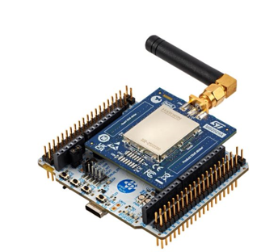

----!
Presentation
----!

# Introduction
## Dear Participant of STM32WL3 Workshop,
 

Welcome to our comprehensive guide on how to prepare for the live version of the STM32WL3 Workshop session. This step-by-step guide is designed to provide you with all the necessary information about the prerequisites, installation process, and links to materials that will be useful during the session.

In this guide, you will find detailed information about the required software and hardware, as well as a brief overview of the installation process. Additionally, we have included links to materials that will be helpful during the session.

 

To navigate through this guide, please use the navigation buttons provided.
 

  

 

If you have any questions or encounter any problems, please do not hesitate to contact us at  **[manuel.marcias@st.com]**

We look forward to seeing you at the STM32WL3 Workshop live session!
 

## Yours,
## STMicroelectronics 
 
----

# Prerequisites
- Hardware:
  - [NUCLEO-WL33CC] Nucleo-64 development board.
  It will be provided to you by ST at the workshop session. 
   
  
   
- Software (preferred PC with **MS Windows 10** operating system):
  - STM32WL3 Cube library in version 0.2.0 OEM it will be sent to you from ST representetive few days before the workshop using secure file transfer
  - ST32WL3 it will be sent to you from ST representetive few days before the workshop sing secure file transfer
  - **Sigfox Credentials** from [here](https://github.com/manu19901991/STM32--South_Africa_Workshop/blob/main/Sigfox_binaries.7z) **
  
 
----

# Materials for the session
- Access to tools dedicated web pages:
  - [STM32WL3 datasheet](https://www.st.com/resource/en/datasheet/stm32wl33cc.pdf)
  - [STM32WL3 reference manual](https://www.st.com/resource/en/reference_manual/rm0511-stm32wl33xx-armbased-wireless-mcus-with-subghz-radio-solution-stmicroelectronics.pdf)
